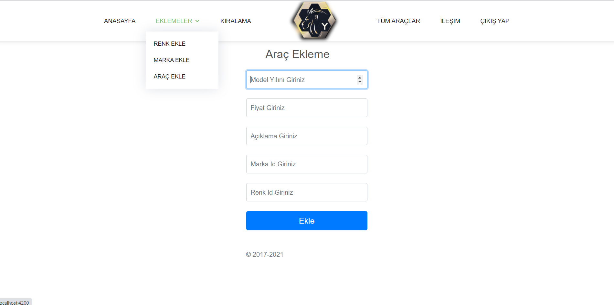

# ReCapFrontend

<h3 align="center">
</img>
</h3>

<h1> ReCap Project Frontend Site Görselleri </h1>
</img>
</img>
</img>
</img>
</img>
</img>
</img>
</img>
</img>
</img>
</img>

<h1> Database Diagram </h1>

</img>

<h1> 
Css dosyaları aktif olarak kullanılmıştır.

bootstrap.min.css
icofont.min.css
boxicons.min.css
venobox.css
aos.css

animate.min.css
toastr.css

owl.carousel.min.css
owl.theme.default.min.css

style.css

</h1>

<h1> 
Js dosyaları aktif olarak kullanılmıştır.

jquery.min.js
bootstrap.bundle.min.js
jquery.easing.min.js
validate.js
jquery.sticky.js
venobox.min.js
isotope.pkgd.min.js
owl.carousel.min.js
aos.js
main.js

</h1>

<i class="icofont-google-map"></i>
<h4>Adres</h4>

Sivas Sivas/Merkez

<i class="icofont-envelope"></i>
<h4>Email:</h4>

https://img.shields.io/github/followers/yasin001905?style=for-the-badge

<i class="icofont-phone"></i>
<h4>Call:</h4>

+90 (538) 273 14 18

<i class="icofont-github"></i>
<h4>Github</h4>

<a href="https://github.com/yasin001905" src="https://img.shields.io/github/followers/yasin001905?style=for-the-badge" />>Yasin Çınar Github < /a>

<i class="icofont-linkedin"></i>
<h4>Linkedin:</h4>

<i class="icofont-hand-power"></i>
<h4>Ekip Arkadaşı</h4>

Kadir Aztekin

<a href="https://github.com/kadir-aztekin">Kadir Aztekin Github</a>

